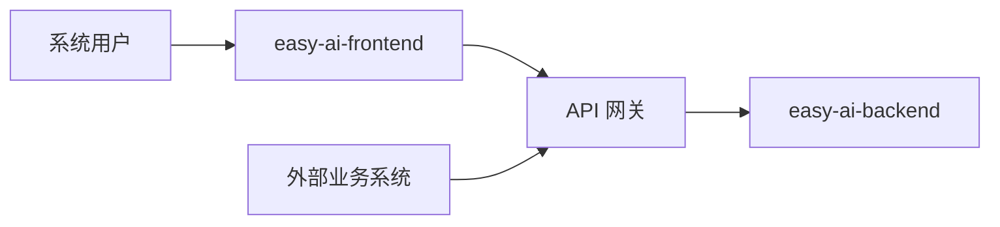
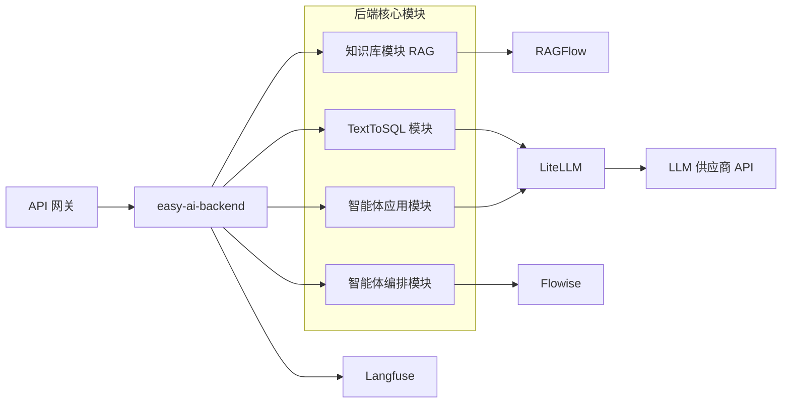

# easy-ai 系统架构文档

本文档用于描述 easy-ai 的总体架构、分层设计、核心模块职责与关键调用链，作为研发、集成与运维协同的统一参考。

## 1. 架构目标与设计原则

easy-ai 面向智能体应用场景，重点保障以下能力：

- 统一接入：前端用户与外部业务系统通过一致入口访问平台能力。
- 模块解耦：业务能力、模型能力、编排能力与观测能力分层治理。
- 可扩展性：支持多模型、多数据库与多场景应用持续演进。
- 可运维性：通过容器化部署与可观测体系支撑稳定运行。

## 2. 技术栈

### 2.1 后端

| 类别 | 选型 |
|------|------|
| 语言 | Python 3.12 |
| Web 框架 | FastAPI + Pydantic + SQLAlchemy |
| 认证与鉴权 | JWT（可与 API Key 共同用于网关/接口访问控制） |
| AI Agent 框架 | LangGraph + LangChain + DeepAgents |
| LLM 模型管理 | LiteLLM（多模型/多供应商统一接入、路由与配置治理） |
| 数据库 | SQLite / PostgreSQL / MySQL（按环境配置） |

### 2.2 前端

| 类别 | 选型 |
|------|------|
| 框架 | Vue 3 + TypeScript |
| 路由 | Vue Router |
| HTTP 客户端 | Axios |

## 3. 部署架构（Docker Compose）

平台以 Docker Compose 组织核心服务，形成一体化运行环境：

| 服务名 | 角色定位 |
|--------|----------|
| `easy-ai-frontend` | Web 交互入口与前端应用承载 |
| `easy-ai-backend` | 核心业务服务，承载 API、业务编排与领域能力 |
| `ragflow` | RAG 引擎服务，支撑知识检索与增强生成流程 |
| `langfuse` | 智能体观测服务，提供 trace、指标与调用分析 |
| `flowise` | 智能体流程编排服务（规划引入/按场景启用） |

> 说明：API 网关可与后端同进程部署，也可独立部署。本文按“逻辑独立组件”描述其职责边界。

## 4. 架构分层

为提升系统可维护性与可扩展性，easy-ai 采用分层架构。各层关注点如下：

| 分层 | 核心职责 | 关键组件 |
|------|----------|----------|
| 访问层 | 提供用户交互与外部系统接入入口 | Frontend、外部业务系统 |
| 网关层 | 统一认证、限流、熔断、审计与转发 | API 网关 |
| 应用层 | 承载业务 API 与领域编排逻辑 | easy-ai-backend |
| 领域能力层 | 提供 RAG、TextToSQL、智能体应用、智能体编排等核心能力 | Backend 四大模块 |
| 模型与工具层 | 统一 LLM 调用治理与外部能力对接 | LiteLLM、RAGFlow、Flowise |
| 可观测层 | 提供链路追踪、指标采集与调用审计关联 | Langfuse |
| 基础设施层 | 提供容器化部署与运行环境支撑 | Docker Compose、数据库 |

```text
+------------------------------------------------------------------+
| 访问层                                                           |
| 用户 / 外部业务系统（风控系统、工单系统、运维门户……）  / Frontend        |
+------------------------------------------------------------------+
                              |
                              v
+------------------------------------------------------------------+
| 网关层                                                           |
| API 网关（API-Key/JWT、限流、熔断、审计）                           |
+------------------------------------------------------------------+
                              |
                              v
+------------------------------------------------------------------+
| 应用层                                                           |
| easy-ai-backend                                                  |
+------------------------------------------------------------------+
               |                              |
               v                              v
+----------------------------------+     +---------------------------+
| 领域能力层                       |       | 可观测层                  |
| RAG / TextToSQL                |       | Langfuse                  |
| 智能体应用 /智能体编排             |      +---------------------------+
+----------------------------------+                   |
         | ----------------------------------------------------
         |             |                |                     |
         v             v                v                     v
+-------------+  +-------------+   +-------------+    +-------------+ 
| 大模型层     |  | 智能体应用    |   | RAG知识库    |    | 智能体编排    |
| LiteLLM     |  | DeepAgents  |   | RAGFlow     |    | Flowise      |
+-------------+  +-------------+   +-------------+    +-------------+
                              |
                              v
+------------------------------------------------------------------+
| 基础设施层                                                       |
| Docker Compose / 数据库                                          |
+------------------------------------------------------------------+
```

## 5. 逻辑架构与调用链

### 5.1 统一入口与网关治理

- 系统用户通过 `easy-ai-frontend` 访问平台能力。
- 外部业务系统（如风控、工单、告警等）可直接调用 API 网关。
- API 网关负责统一治理：`API-Key/JWT` 认证、限流、熔断、调用审计。
- 网关完成策略校验后，将请求路由至 `easy-ai-backend`。



### 5.2 后端核心能力编排

`easy-ai-backend` 内部由四大模块构成：

- 知识库模块（RAG）：底层依赖 `RAGFlow` 提供检索增强能力。
- TextToSQL 模块（自研）：包含模型语义层、模型知识库 RAG、智能探索（DeepAgents）与定时作业。
- 智能体应用模块：基于 `DeepAgents + LiteLLM` 实现任务执行与模型调用。
- 智能体编排模块：基于 `Flowise` 实现流程化编排能力（按场景启用）。

此外，后端通过 `LiteLLM` 统一治理模型调用（模型路由、供应商切换、配置管理），并将运行链路上报到 `Langfuse` 构建平台级可观测能力。



## 6. 结论

- 架构边界清晰：访问入口、网关治理、应用编排与外部能力解耦。
- 能力组合灵活：RAG、TextToSQL、智能体应用与编排可独立演进。
- 模型治理统一：以 LiteLLM 收敛多模型调用策略，降低供应商耦合。
- 运维可观测：通过 Langfuse 建立平台级链路追踪与问题定位能力。

---

*文档更新日期：2026-03-26*
